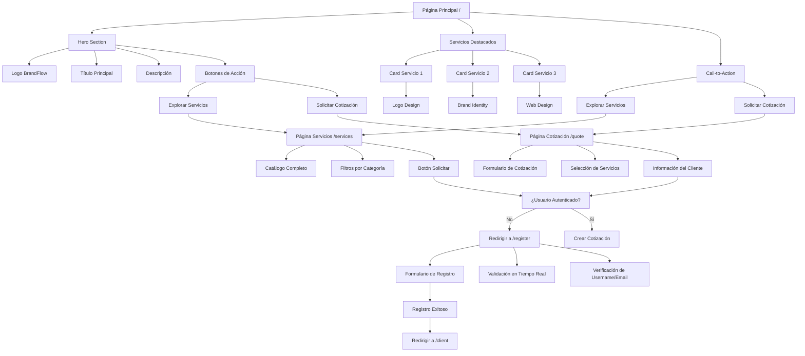
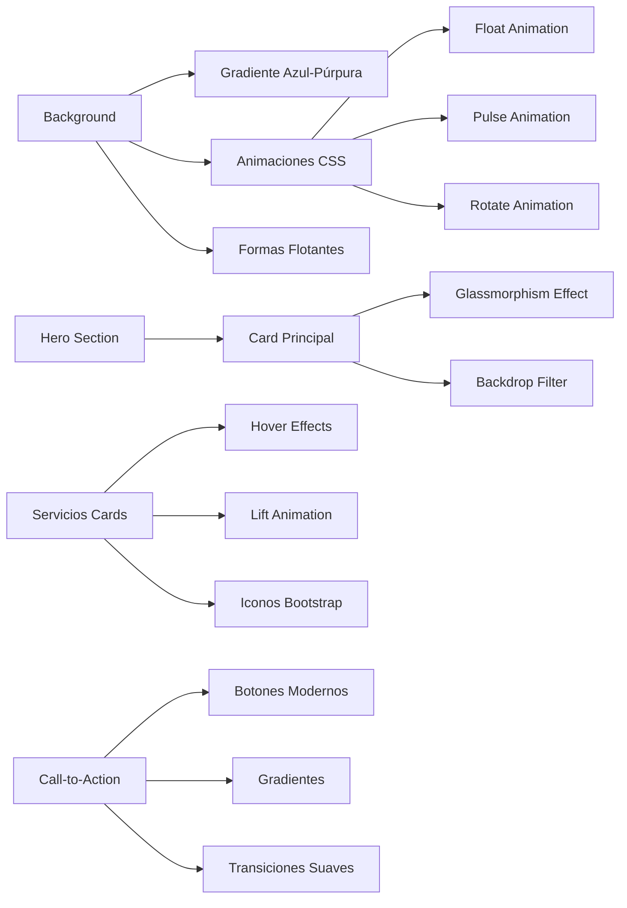
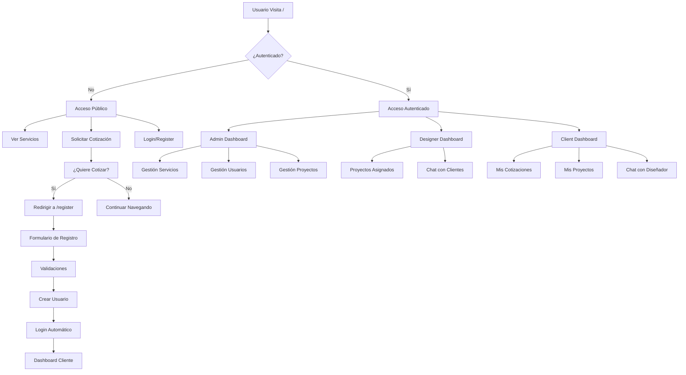
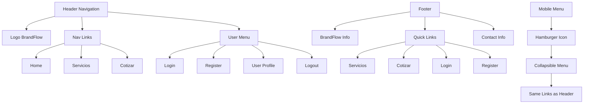
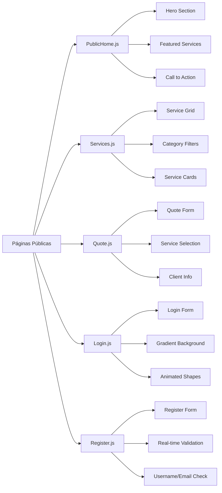
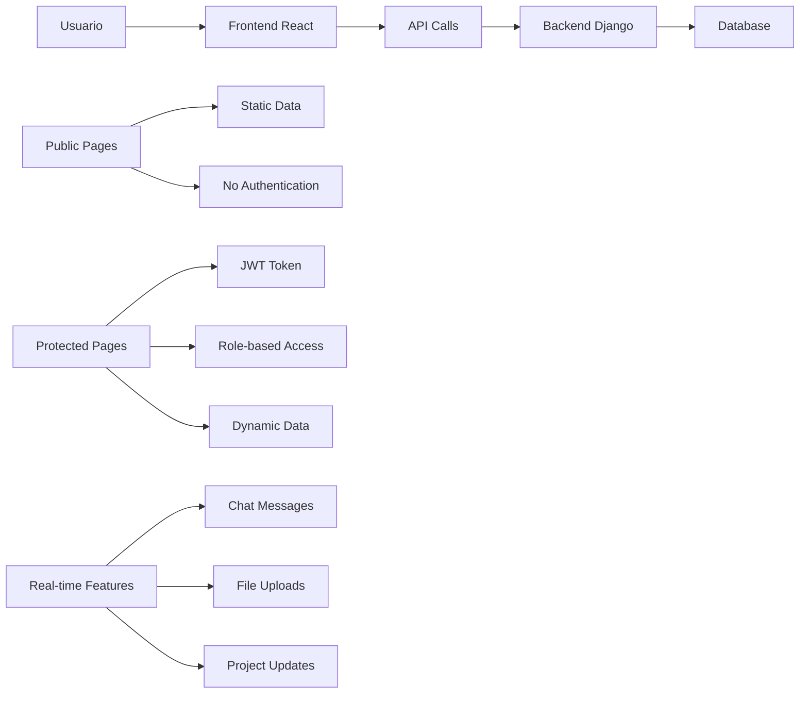
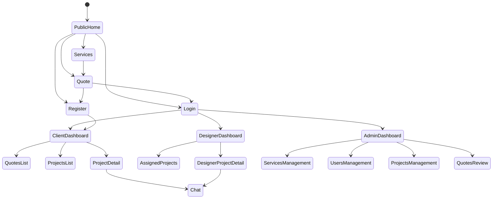

# BrandFlow Frontend - Estructura del Home y Navegación

## 🏠 Estructura del Home Público

## 🎨 Diseño Visual del Home

## 🔐 Flujo de Autenticación

## 📱 Estructura de Navegación

## 🎯 Páginas Públicas

## 🔧 Estructura de Archivos Frontend

```mermaid
graph TD
    A[src/] --> B[pages/]
    A --> C[components/]
    A --> D[api/]
    A --> E[context/]
    A --> F[styles/]
    
    B --> B1[admin/]
    B --> B2[client/]
    B --> B3[designer/]
    B --> B4[PublicHome.js]
    B --> B5[Services.js]
    B --> B6[Quote.js]
    B --> B7[Login.js]
    B --> B8[Register.js]
    
    B1 --> B1a[AdminDashboard.js]
    B1 --> B1b[ServicesManagement.js]
    B1 --> B1c[UsersManagement.js]
    B1 --> B1d[ProjectsManagement.js]
    B1 --> B1e[QuotesReview.js]
    
    B2 --> B2a[ClientDashboard.js]
    B2 --> B2b[QuotesList.js]
    B2 --> B2c[ProjectsList.js]
    B2 --> B2d[ProjectDetail.js]
    
    B3 --> B3a[DesignerDashboard.js]
    B3 --> B3b[AssignedProjects.js]
    B3 --> B3c[DesignerProjectDetail.js]
    
    C --> C1[Header.js]
    C --> C2[ProtectedRoute.js]
    C --> C3[RoleGuard.js]
    C --> C4[FeatureCard.js]
    C --> C5[Footer.js]
    
    D --> D1[http.js]
    D --> D2[auth.js]
    D --> D3[admin.js]
    D --> D4[branding.js]
    
    E --> E1[AuthContext.js]
    
    F --> F1[theme.css]
    F --> F2[public.css]
    
    G[App.css] --> G1[Gradient Backgrounds]
    G --> G2[Animation Keyframes]
    G --> G3[Glassmorphism Effects]
```

## 🎨 Características de Diseño

### Colores y Gradientes
- **Primary Gradient**: `linear-gradient(135deg, #667eea 0%, #764ba2 100%)`
- **Secondary Gradient**: `linear-gradient(135deg, #f093fb 0%, #f5576c 100%)`
- **Success Gradient**: `linear-gradient(135deg, #4facfe 0%, #00f2fe 100%)`

### Animaciones
- **Float**: Movimiento suave vertical
- **Pulse**: Efecto de respiración
- **Rotate**: Rotación continua
- **Hover Lift**: Elevación en hover

### Efectos Visuales
- **Glassmorphism**: `backdrop-filter: blur(10px)`
- **Box Shadow**: `0 8px 32px rgba(0, 0, 0, 0.1)`
- **Border Radius**: `20px` para cards
- **Transitions**: `all 0.3s ease`

## 📊 Flujo de Datos

## 🔄 Estados de la Aplicación

## 🎯 Objetivos del Home

1. **Atraer Visitantes**: Diseño moderno y profesional
2. **Mostrar Servicios**: Catálogo visual atractivo
3. **Generar Conversiones**: Call-to-action efectivos
4. **Facilitar Registro**: Proceso simple y rápido
5. **Establecer Confianza**: Branding consistente

## 🚀 Optimizaciones Implementadas

- **Lazy Loading**: Carga diferida de componentes
- **Responsive Design**: Adaptable a todos los dispositivos
- **Performance**: Optimización de imágenes y CSS
- **SEO Friendly**: Meta tags y estructura semántica
- **Accessibility**: Navegación por teclado y screen readers
